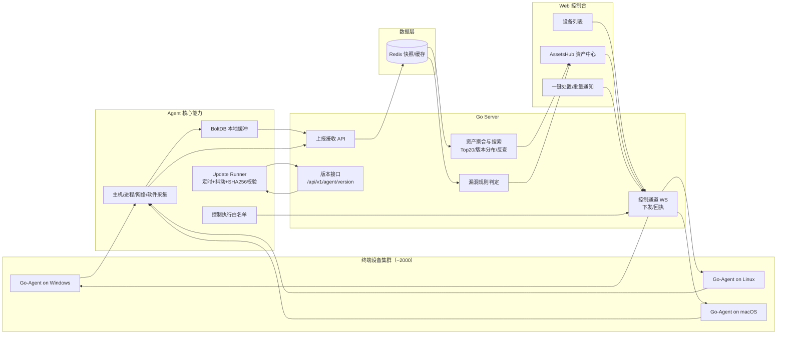

# Go Agent - 工业级终端监控与治理平台

跨平台 IT 设备监控与治理系统（Windows/Linux/macOS），覆盖 **资产盘点、漏洞预警、远程控制、自动更新、批量部署**，面向 2,000 台量级场景设计。

## Key Features

- **全网资产审计**：采集并聚合软件资产，支持 Top20 热度统计、版本分布、设备反查与穿透搜索。
- **漏洞自动预警**：基于版本规则识别高风险软件版本，支持风险标记与批量处置联动。
- **WebSocket 双向控制通道**：服务端可向指定设备下发 `restart_service` / `custom_script` / `force_update` 等指令，并接收执行结果回执。
- **高并发弹性架构（2,000 节点）**：
  - Agent 端本地 BoltDB 缓冲抗抖动
  - 资产查询与聚合缓存
  - 更新检查带随机抖动，避免同时风暴
- **自动更新与自愈**：
  - 定时检查 + 强制触发（`force_update`）
  - SHA256 校验
  - Windows `.bat` 后台自替换，Linux 原子重命名
  - 启动失败回滚保护（连续失败阈值）

## 架构总览

- **Agent**：采集主机指标、进程/服务、网络连接、软件资产并上报。
- **Server**：接收上报、资产聚合、版本分发、控制通道、通知抑制。
- **Web 前端**：设备总览 + `AssetsHub` 资产中心（热力图、版本分布、风险检索、一键处置）。
- **数据层**：Redis 快照与聚合缓存；Agent 侧 BoltDB 离线缓冲。

### 能力总览架构图



极简 ASCII 兜底（Mermaid 不可渲染时看这个）：

```text
           +------------------- Web Console -------------------+
           | Device List | AssetsHub | One-click Fix / Batch   |
           +-------------------------+--------------------------+
                                   |
                            Control WS (commands/results)
                                   |
  +----------- Fleet (~2000) ------------+            +-------------------+
  | Windows Agent | Linux Agent | macOS  |<---------->| Go Server         |
  +--------------------------------------+            | - Ingest API      |
            |         metrics/assets                     | - WS Control     |
            +------------------------------->            | - Version API    |
                                                        | - Aggregation    |
                                                        | - Vuln Rules     |
                                                        +---------+--------+
                                                                  |
                                                                  v
                                                           +-------------+
                                                           | Redis       |
                                                           | snapshots & |
                                                           | caches      |
                                                           +-------------+

  Update loop: Agent(Update Runner: jitter + SHA256) <----> Server(/api/v1/agent/version)
```

## 目录结构（建议）

```
.
├─ cmd/                       # agent/server 入口
├─ internal/                  # 核心实现
├─ web/                       # 前端（Vue3 + Vite）
├─ var/                       # 本地运行数据（缓存/db/前端构建等，默认忽略提交）
├─ docs/
│  └─ DEPLOY_SOP.md            # 面向普通用户的安装/故障处理手册（最新版）
│  └─ notes/                   # 临时/开发笔记（可选）
├─ deploy/
│  ├─ linux/
│  │  └─ deploy_agent.yml      # Linux Ansible 批量部署（canonical）
│  └─ windows/
│     ├─ deploy_agent.ps1      # Windows 批量部署（canonical）
│     └─ install.bat           # Windows 本地安装脚本（打包用）
├─ examples/
│  ├─ certs/                   # mTLS 证书/CSR 示例（本地生成物默认忽略提交）
│  └─ mtls/                    # mTLS/联调示例工具
├─ scripts/
│  └─ check_health.sh          # 自助诊断（/healthz + Redis + 可选接口）
│  └─ dev/                     # 本地开发辅助脚本（backend/frontend/一键重启等）
└─ templates/                  # systemd / 安装脚本模板
```

## 快速开始（2,000 台 Ansible 场景）

### 1) 准备

- 生成构建产物并确认 `dist/` 下存在：
  - `go-agent-amd64`
  - `go-agent-arm64`
- 配置后端控制 token（如 `CONTROL_CHANNEL_TOKEN`）。
- 准备 inventory 文件 `hosts`。

### 2) 一键分批安装

```bash
ansible-playbook -i hosts deploy/linux/deploy_agent.yml \
  -e agent_server_addr="http://10.x.x.x:8080" \
  -e agent_control_token="your_secure_token"
```

`deploy/linux/deploy_agent.yml` 已内置：
- `serial: "10%"`（分批推进）
- `max_fail_percentage: 10`（失败率保护）
- 按 `ansible_architecture` 自动下发 amd64/arm64 对应二进制

### 3) 验证

```bash
systemctl status go-agent
getcap /usr/local/bin/go-agent
```

## 部署体系（Deployment）

### Linux 批量部署：`deploy/linux/deploy_agent.yml`

- 自动创建运行用户/组
- 分发二进制并设置执行权限
- `setcap cap_net_bind_service=+ep`
- 下发 systemd 服务模板并启用启动
- 支持分批与失败阈值控制

### Windows 批量部署：`deploy/windows/deploy_agent.ps1`

- 基于 WinRM + `Copy-Item -ToSession` 远程分发
- 自动检查/安装 NSSM，并注册为服务
- 自动配置防火墙出站规则
- 幂等：版本一致时跳过重装，仅确保服务运行

## 资产中心（AssetsHub）

前端 `AssetsHub` 支持：
- 全网软件 Top20 热力统计
- 软件版本分布联动图（含风险高亮）
- 全网资产穿透搜索（软件/端口）
- 风险设备一键处置与批量通知
- 缓存状态与更新时间可视化

## 安全机制

- **双 Token 校验**：
  - 控制 WS 接入校验（`CONTROL_CHANNEL_TOKEN`）
  - 指令下发载荷校验（`CONTROL_COMMAND_TOKEN`）
- **Agent 执行白名单**：
  - 限定脚本与服务范围
  - 非白名单命令拒绝执行
- **版本包完整性校验**：
  - 更新下载后必须通过 `sha256` 校验

## 自动更新（Update Runner）

- 周期检查：默认每 6 小时
- 启动检查：进程启动后立即检查一次
- 随机抖动：每次检查前随机延迟，避免集中下载
- 强制触发：控制通道 `force_update`
- Windows 替换：`.new + .bat` 后台替换并重启服务（含 5 秒缓冲）
- Linux 替换：`os.Rename` 平滑覆盖

## 运行与配置（基础说明，保留）

### Agent 关键参数

- `-data-dir`：本地数据目录（BoltDB 缓存位于该目录 `agent_cache.db`）
- `-api-url`：后端上报地址
- `-control-token`：控制通道共享 token
- `-device-id`：设备唯一标识（控制通道/灰度更新建议固定）
- `-version`：运行时版本标识（用于上报与更新比较）
- mTLS 证书相关：
  - `-ca-cert`：CA 根证书（PEM）
  - `-client-cert`：客户端证书（PEM）
  - `-client-key`：客户端私钥（PEM）
  - `-insecure-skip-verify`：演示用；生产建议 `false`

### 前台调试

```bash
./agent -debug -data-dir ./data
```

> `-debug` 模式会前台运行，`Ctrl+C` 优雅停止。

## 注册为系统服务（基础说明，保留）

项目使用 `github.com/kardianos/service` 作为跨平台服务管理库。

```bash
# Linux / macOS
sudo ./agent install
sudo ./agent start
sudo ./agent stop
sudo ./agent remove

# Windows（管理员 PowerShell）
.\agent.exe install
.\agent.exe start
.\agent.exe stop
.\agent.exe remove
```

## 构建

```bash
make
```

输出目录：`dist/`

## 版本信息注入

```bash
go build -ldflags "\
  -X 'github.com/qinyilin/go-agent/cmd/agent.Version=1.2.3' \
  -X 'github.com/qinyilin/go-agent/cmd/agent.BuildTime=2026-03-31T00:00:00Z' \
  -X 'github.com/qinyilin/go-agent/cmd/agent.GitCommit=abcdef0' \
"
```

## 文档与手册

- 面向普通用户的安装/故障处理手册：`docs/DEPLOY_SOP.md`

如果当前仓库处于离线构建模式（`go.mod` 含 `replace` 指向本地 stub），建议发布前移除这些 `replace` 以使用真实依赖。
